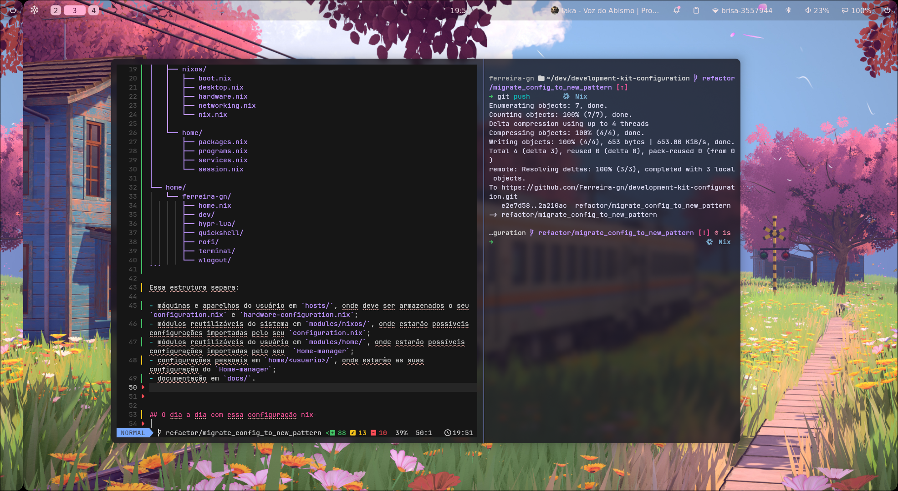

# Nixos configuration

Este repositório reúne as configurações que utilizo diariamente no meu ambiente de desenvolvimento. Sinta-se à vontade para explorar os arquivos, estudar a organização adotada e adaptar o conteúdo às necessidades do seu próprio setup. Entretanto, algumas configurações dependem de uma ordem específica de execução e exigem atenção durante os processos de build, ativação e atualização. Caso você ainda não tenha muita experiência com NixOS, Flakes ou Home Manager, recomendo a leitura das próximas seções antes de aplicar qualquer alteração ao sistema.





A organização deste projeto segue um modelo modular bastante utilizado pela comunidade NixOS. O Flake é responsável por declarar e versionar as entradas do projeto, como o Nixpkgs, o Home Manager e outras dependências externas. A configuração do NixOS gerencia exclusivamente o sistema, incluindo bootloader, hardware, serviços, usuários e recursos globais. Já o Home Manager gerencia a sessão do usuário, seus pacotes, programas, dotfiles e preferências pessoais. Embora ambos utilizem os mesmos inputs definidos pelo Flake, suas configurações e processos de ativação são independentes. Essa separação permite reconstruir o sistema e atualizar o ambiente do usuário individualmente. A seguir, confira a estrutura adotada pelo repositório.


```text
development-kit-configuration/
├── flake.nix
├── flake.lock
├── README.md
├── docs/
├── hosts/
│   └── nixos/
│       ├── configuration.nix
│       └── hardware-configuration.nix
├── modules/
│   ├── nixos/
│   │   ├── boot.nix
│   │   ├── desktop.nix
│   │   ├── hardware.nix
│   │   ├── networking.nix
│   │   └── nix.nix
│   │
│   └── home/
│       ├── packages.nix
│       ├── programs.nix
│       ├── services.nix
│       └── session.nix
│
└── home/
    └── ferreira-gn/
        ├── home.nix
        ├── dev/
        ├── hypr-lua/
        ├── quickshell/
        ├── rofi/
        ├── terminal/
        └── wlogout/
```

Essa estrutura separa:

- máquinas e aparelhos do usuário em `hosts/`, onde deve ser armazenados o seu `configuration.nix` e `hardware-configuration.nix`;
- módulos reutilizáveis do sistema em `modules/nixos/`, onde estarão possíveis configurações importadas pelo seu `configuration.nix`;
- módulos reutilizáveis do usuário em `modules/home/`, onde estarão possíveis configurações importadas pelo seu  `Home-manager`;
- configurações pessoais em `home/<usuario>/`, onde estarão as suas configuração do `Home-manager`;
- documentação em `docs/`.

<br/>


> Caso esta seja sua primeira instalação ou você pretenda migrar uma configuração existente para o modelo adotado neste repositório, consulte o guia de primeira instalação e migração. O documento explica como preparar um novo host, gerar ou reutilizar o hardware-configuration.nix, registrar o sistema no Flake, instalar o NixOS e ativar o Home Manager com segurança. [detalhes do documento](./docs/first-installation-and-migration.md) 

<br/>
<br/>
<br/>

## O dia a dia com o Home-manager

<br/>

No uso cotidiano, não é necessário reconstruir todo o sistema sempre que um novo pacote ou uma configuração pessoal for adicionada. As configurações do NixOS e do Home Manager são independentes, portanto cada uma deve ser atualizada somente quando houver alterações em sua respectiva responsabilidade.

Ao adicionar um novo pacote ao Home Manager, basta editar o módulo correspondente, adicionar o arquivo ao índice do Git e executar o comando de ativação. O Home Manager avaliará a configuração atual, reutilizará tudo o que já estiver disponível no Nix Store e baixará ou compilará apenas os novos pacotes e dependências necessários.

```
  git add home/ modules/home flake.nix flake.lock
```

```
home-manager switch \
  --flake '.#<username>@<host>' \
  --option max-jobs 1 \      # número de processos em paralelos (opcional)
  --option cores 2 \         # número de nucleos (opcional) 
  -b backup                  # backup dos pacotes antigos (opcional)
```

Os pacotes não são atualizados automaticamente a cada execução do switch. O Home Manager aplica exatamente as versões registradas no flake.lock. Para atualizar as versões dos pacotes, primeiro é necessário atualizar o input correspondente e, em seguida, executar novamente o switch.


```
nix flake update nixpkgs home-manager
```


```
home-manager switch \
  --flake '.#<username>@<host>' \
  --option max-jobs 1 \      # número de processos em paralelos (opcional)
  --option cores 2 \         # número de nucleos (opcional) 
  -b backup                  # backup dos pacotes antigos (opcional)
```

No uso cotidiano, os comandos apresentados anteriormente são suficientes para manter o ambiente atualizado e aplicar alterações sem reconstruções desnecessárias.

<br/>

<br/>

<br/>

<br/>
<br/>


## O dia a dia com o configuração nix 

<br/>

A configuração do NixOS, definida principalmente em `configuration.nix` e nos módulos importados por ele, só precisa ser reconstruída quando houver mudanças de nível sistêmico, como alterações em serviços globais, usuários, drivers, bootloader, hardware, rede ou outros componentes administrados pelo sistema. Antes de aplicar qualquer alteração, é recomendável validar o Flake com `nix flake check --show-trace`. Essa verificação identifica problemas de avaliação, imports incorretos, opções inválidas e conflitos entre módulos antes que qualquer mudança seja aplicada ao sistema.

```fish
nix flake check --show-trace
```

Quando for necessário apenas confirmar que a nova configuração pode ser construída, sem ativá-la e sem criar o link simbólico `result` dentro do repositório, utilize o comando abaixo. O parâmetro `--no-link` mantém o resultado somente no Nix Store.

```fish
nix build \
  .#nixosConfigurations.nixos.config.system.build.toplevel \
  --no-link \
  --option max-jobs 1 \
  --option cores 2
```

Para validar o comportamento da nova configuração no sistema em execução, pode-se utilizar `nixos-rebuild test`. Esse modo ativa temporariamente as alterações, mas não define a nova geração como padrão para o próximo boot. Caso algum serviço apresente problemas, basta reiniciar o computador para retornar à última geração estável configurada.

```fish
sudo nixos-rebuild test \
  --flake .#<host> \
  --option max-jobs 1 \
  --option cores 2
```

Após confirmar que rede, ambiente gráfico, áudio, serviços e demais recursos estão funcionando corretamente, a configuração pode ser aplicada definitivamente com `nixos-rebuild switch`. Esse comando ativa a nova geração e a define como padrão para os próximos boots.

```fish
sudo nixos-rebuild switch \
  --flake .#<host> \
  --option max-jobs 1 \
  --option cores 2
```

Ao final, você também pode optar por ignorar as etapas de validação anteriores e utilizar diretamente o comando de rebuild completo. No entanto, essa abordagem exige mais cautela, pois falhas de avaliação, compilação, ativação ou incompatibilidades entre pacotes podem comprometer a nova geração e afetar o próximo boot do sistema. Por isso, utilize esse fluxo apenas quando estiver seguro das alterações realizadas e mantenha sempre uma geração estável disponível para recuperação. Recoemndo ao menos realizar um flake check antes de continuar.

